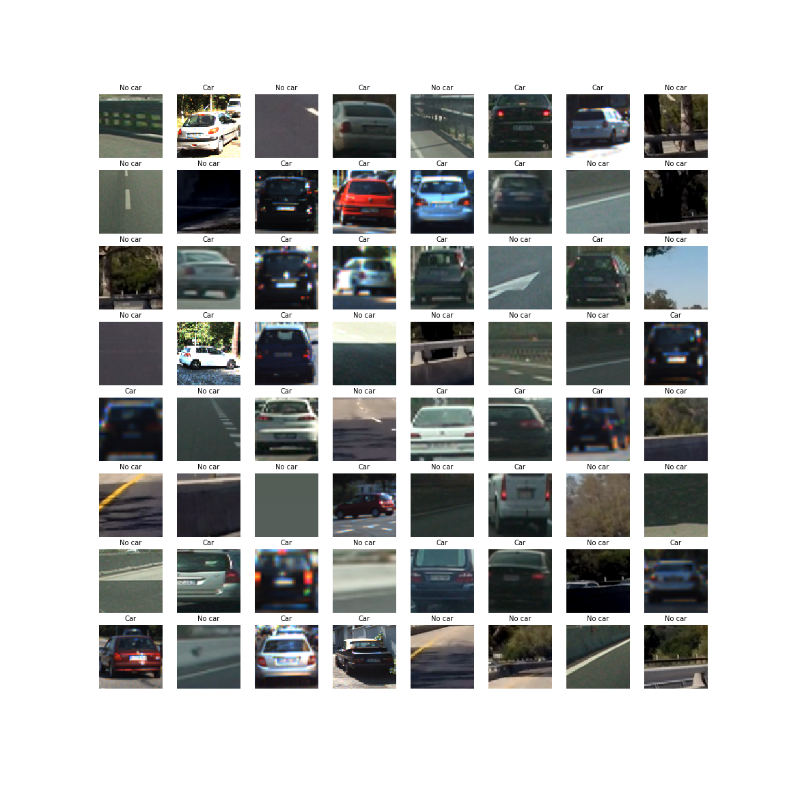
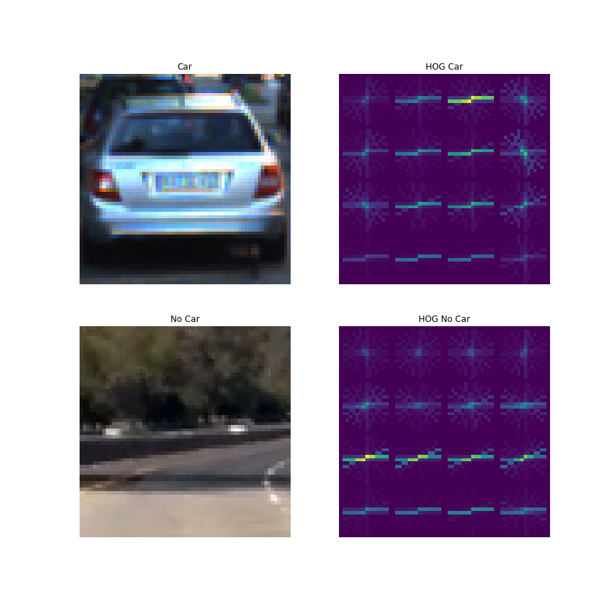
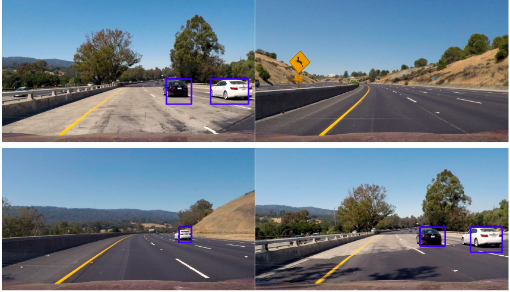
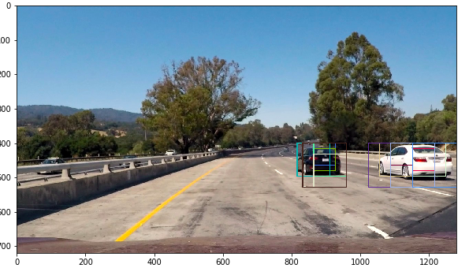
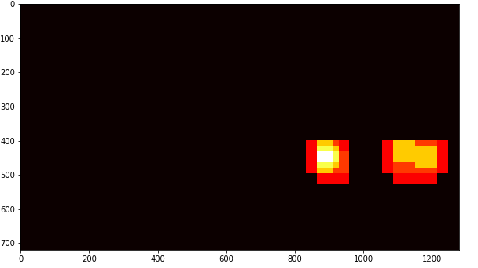
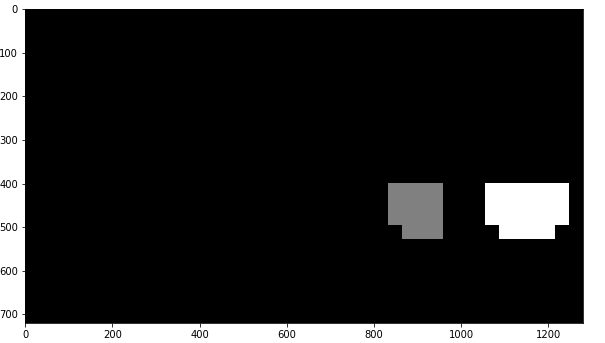
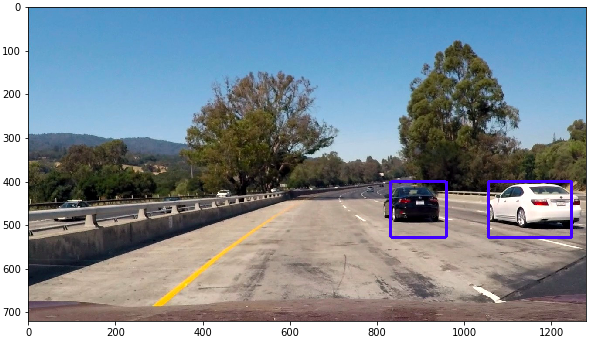

## Writeup Template

## [Rubric](https://review.udacity.com/#!/rubrics/513/view) Points
### Here I will consider the rubric points individually and describe how I addressed each point in my implementation.  

---
### Writeup / README

#### 1. Provide a Writeup / README that includes all the rubric points and how you addressed each one.  You can submit your writeup as markdown or pdf.  [Here](https://github.com/udacity/CarND-Vehicle-Detection/blob/master/writeup_template.md) is a template writeup for this project you can use as a guide and a starting point.  

You're reading it!

### Histogram of Oriented Gradients (HOG)

#### 1. Explain how (and identify where in your code) you extracted HOG features from the training images.

The code for this step is contained in the `Solution.ipynb`
in the function `extract_hog_features()`

I started by reading in all the `vehicle` and `non-vehicle` images.  Here are examples of `vehicle` and `non-vehicle` classes:

I used the function `extract_hog_features()` that is similar to one taught in the lesson. 
#### 2. Explain how you settled on your final choice of HOG parameters.

I tried various color spaces and hyperparameter values of orientation ,pix\_per\_cell and cell\_per\_block through a double hyper parameter search of first randomly searching for value of pix\_per\_cell in range (8,20),cell\_per\_block in range (2,5) and then precise search to settle at values of 11 for orientation,16 for pix\_per\_cell,2 for cell\_per_block.YUV colorspace was used.

Here is an example image-

 

#### 3. Describe how (and identify where in your code) you trained a classifier using your selected HOG features (and color features if you used them).

I trained a linear SVM using the hog features on all channels of YUV color space.It can be found in `solution.ipynb` in 12th cell.It gave an accuracy of 98.2%

### Sliding Window Search

#### 1. Describe how (and identify where in your code) you implemented a sliding window search.  How did you decide what scales to search and how much to overlap windows?

The sliding window search is implemented in the function find_cars() in `solution.ipynb`.I implemented this function similar to the lecture notes which instead of calculating hog of each blob of image one by one,calculates the hog features at once and then subsamples them.

I chose four values of scales namely 1,1.5,2,3.5 and proportionately settled upon the y values of the image.Larger scales were tried closer to the screen while smaller,deep into the screen.

#### 2. Show some examples of test images to demonstrate how your pipeline is working.  What did you do to optimize the performance of your classifier?

Here are the results:

---

### Video Implementation

#### 1. Provide a link to your final video output.  Your pipeline should perform reasonably well on the entire project video (somewhat wobbly or unstable bounding boxes are ok as long as you are identifying the vehicles most of the time with minimal false positives.)
Here's a [link to my video result](https://youtu.be/FYbithRLgpU)

#### 2. Describe how (and identify where in your code) you implemented some kind of filter for false positives and some method for combining overlapping bounding boxes.

I recorded the positions of positive detections in each frame of the video.  From the positive detections I created a heatmap and then thresholded that map to identify vehicle positions.  I then used `scipy.ndimage.measurements.label()` to identify individual blobs in the heatmap.  I then assumed each blob corresponded to a vehicle.  I constructed bounding boxes to cover the area of each blob detected.Here is an full blown example:

### Discussion

#### 1. Briefly discuss any problems / issues you faced in your implementation of this project.  Where will your pipeline likely fail?  What could you do to make it more robust?

Here I used a very crude approach of training a linear SVM over all channels of YUV image and then using heat-map to counter false positives.
An obvious case when this pipeline might fail is when there are cars which are not represented by the training data(i.e. their HOG features).Also during close approach and separation of two or more vehicles, the speed of recognising the vehicle is also unimpressive.